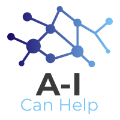

# AICanHelp
Predicting the growth of COVID-19 in counties across the U.S. and identifying the most at-risk hospitals within a selected county.
# Motivation 
Frontline healthcare workers are in danger due to the severe shortage of PPE supply in hospitals. We wanted to create a platform for corporations looking to donate essential supplies during the COVID-19 pandemic to use and prioritize where to send these donations to. 
# Features 
1) **Predictive analysis** using a linear regression model to forecast the of confirmed COVID-19 cases in a particular county for the next three days, using daily-updated data. Companies can potentially use this predictive model to take preemptive action with their donations and save hospitals valuable time.

2) **Graphical visualization** of COVID-19 case growth trends over the past week.

3) **Visualization of the risk level** for all hospitals in a particular county. By dividing the number of confirmed COVID cases in a hospital's city by the number of ICU beds available in that hospital, we calculate a Risk Index that corporations can use to prioritize at-risk hospitals who need supplies the most. The more bottom-right the hospital is on the graph and the lighter its color, the greater its risk.
# Data Sources 
The New York Times, New York State Department of Health 
